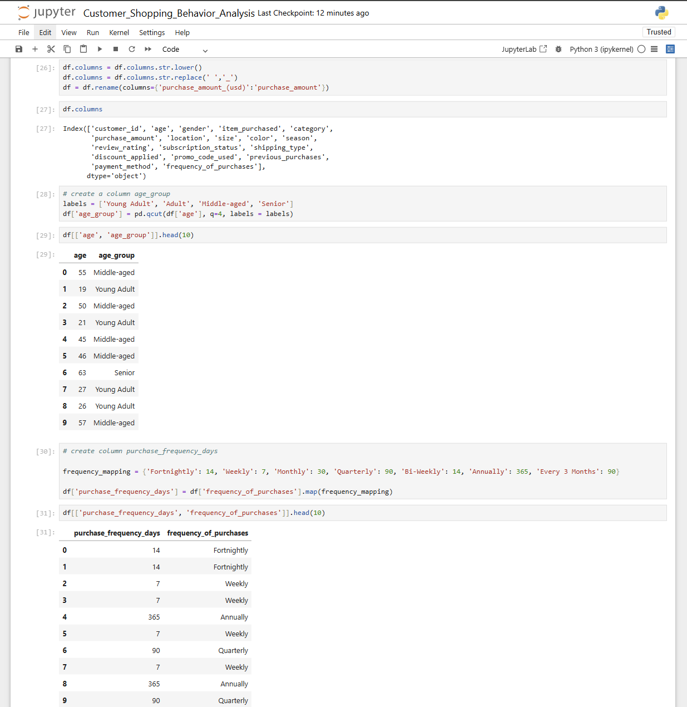
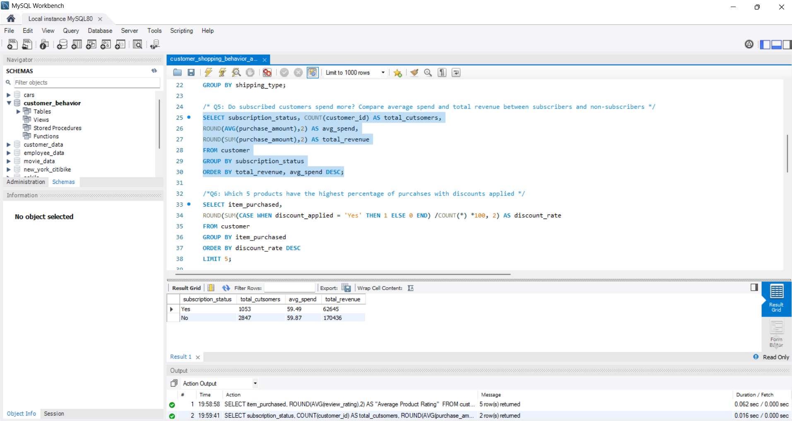
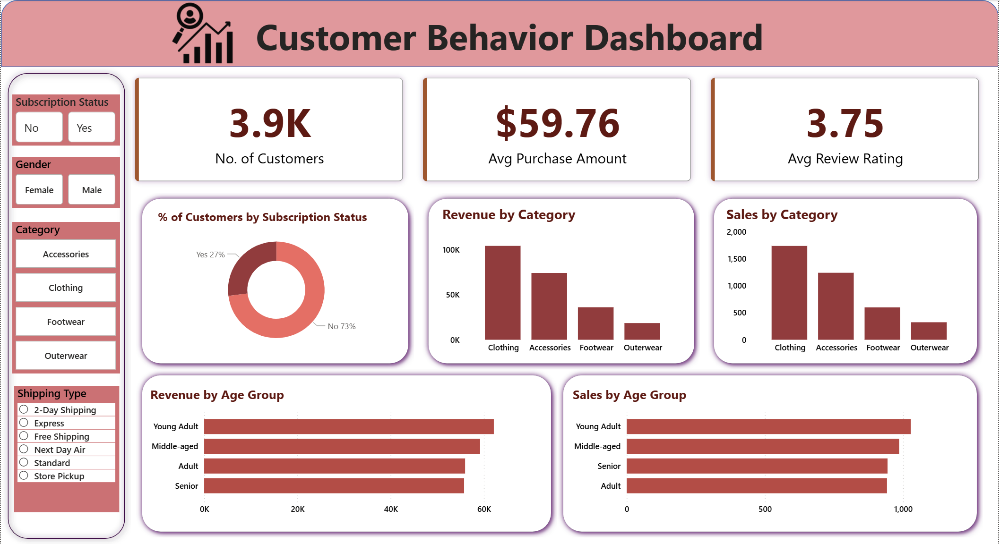

# Customer Shopping Behaviour Analysis 🛍️ 

## Project Overview
This project analyzes customer shopping data to understand purchasing patterns, product preferences, and category-wise trends. The dataset was cleaned using Python, analyzed using SQL, and visualized using an interactive Power BI dashboard.

The goal of this project is to transform raw customer transaction data into meaningful insights that help businesses understand customer behavior and improve decision-making related to sales strategies and product performance.

-----------------------------------------------------------------------------------------------------------------------------------------------------------------

## Objectives
- Analyze customer purchasing behavior
- Identify the most purchased products within each category
- Understand category-wise product performance
- Discover patterns in customer shopping habits
- Present insights through an interactive dashboard

-----------------------------------------------------------------------------------------------------------------------------------------------------------------

## Tools & Technologies Used
- Python (Pandas) – Data cleaning and preprocessing  
- SQL (MySQL) – Data querying and analysis  
- Power BI – Data visualization and dashboard creation  
- Excel / CSV – Dataset format 

-----------------------------------------------------------------------------------------------------------------------------------------------------------------

## Dataset Description
The dataset contains customer shopping information including:

- Customer ID  
- Category
- Gender
- Age, Age Group
- Item Purchased  
- Purchase Amount 
- Review Rating  
- Subscription Status
- Shipping type
- Discount Applied
- Payment Method
- Frequency of Purchases  

The data was cleaned and prepared before analysis to ensure consistency and accuracy.

-----------------------------------------------------------------------------------------------------------------------------------------------------------------

## Data Cleaning (Python)
Data cleaning was performed using Python to prepare the dataset for analysis. The main steps included:

- Handling missing values in review ratings using category-wise median.
- Standardizing column names by converting them to lowercase and replacing spaces with underscores.
- Creating a new age_group feature for customer segmentation.
- Converting purchase frequency categories into numerical values for easier analysis.
- Preparing the dataset for SQL analysis

-----------------------------------------------------------------------------------------------------------------------------------------------------------------

## SQL Analysis
SQL queries were used to analyze the dataset and extract meaningful insights.

Some of the analysis performed includes:

- Identifing the top 3 most purchased products within each category
- Analyzing category-wise purchase trends
- Calculating average purchase amount by category
- Analyzing customer distribution by gender
- Comparing Subscriber vs Non-Subscriber Spending Analysis

-----------------------------------------------------------------------------------------------------------------------------------------------------------------

## Power BI Dashboard
An interactive Power BI dashboard was developed to visualize the insights derived from the analysis.

The dashboard includes:

- Category-wise purchase distribution
- Top-selling products
- Revenue and Sales by Category 
- Revenue and Sales by Age Group
- Subscription Status
- Gender
- Shipping Type

These visualizations make the data easier to interpret and help support data-driven business decisions.

-----------------------------------------------------------------------------------------------------------------------------------------------------------------

## Key Insights
- Certain product categories show significantly higher purchase frequency.
- A small number of products dominate sales within categories.
- Customer purchasing behavior varies across different product groups.
- Insights from the analysis can help businesses improve inventory planning and marketing strategies.

-----------------------------------------------------------------------------------------------------------------------------------------------------------------

## Author
Rachana Hebbar

Aspiring Data Analyst skilled in Python, SQL, and Power BI, passionate about transforming data into meaningful insights and building data-driven solutions.
